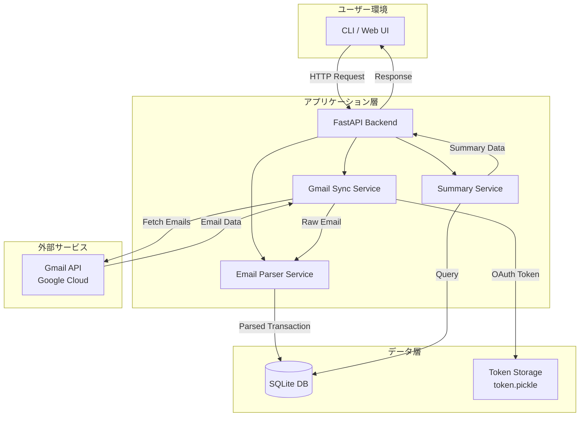
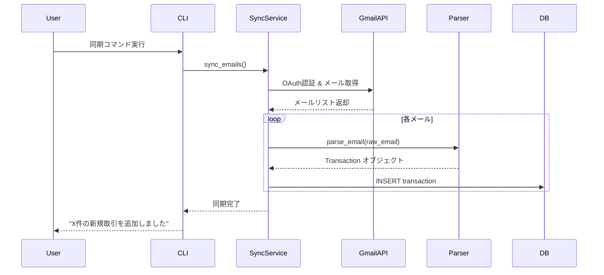
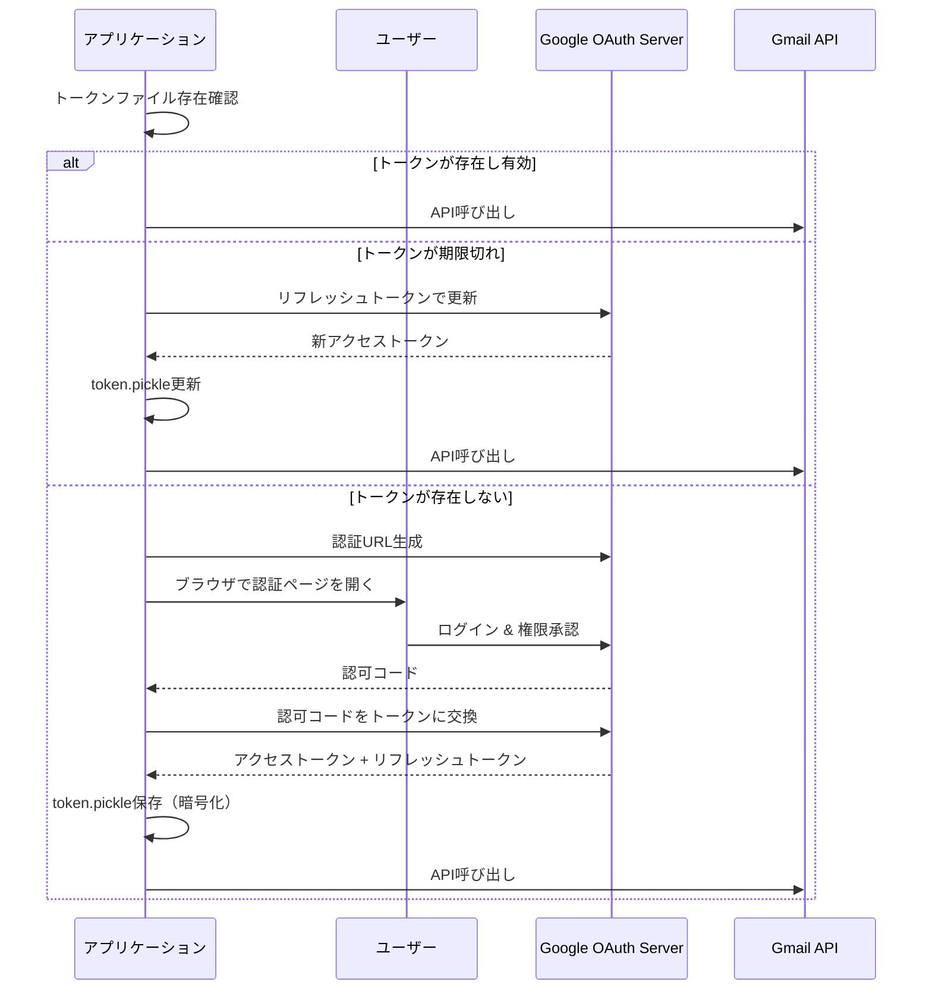
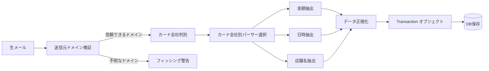

# クレジットカード月間使用額管理システム 統合設計ドキュメント

**プロジェクト名**: card-spending-tracker
**バージョン**: 1.0.0
**最終更新**: 2026-02-15
**ステータス**: 設計完了 → 実装フェーズ準備完了

---

## 目次

1. [プロジェクト概要](#1-プロジェクト概要)
2. [システムアーキテクチャ](#2-システムアーキテクチャ)
3. [Gmail API連携設計](#3-gmail-api連携設計)
4. [メール解析設計](#4-メール解析設計)
5. [データモデル設計](#5-データモデル設計)
6. [技術スタック](#6-技術スタック)
7. [開発ロードマップ](#7-開発ロードマップ)
8. [未決定事項・リスク一覧](#8-未決定事項リスク一覧)

---

## 1. プロジェクト概要

### 1.1 プロジェクトの目的

クレジットカード会社から送信される**利用通知メール**をGmail APIで自動取得し、金額・日時・店舗名を抽出して月次集計を行う個人向け管理ツールを構築する。

**主な狙い**:
- クレジットカードの使いすぎを防止する
- 月間の支出をカード会社別・月別に可視化
- 不正利用の早期検知（メール通知を自動監視）

### 1.2 背景

現状の課題:
- 複数のクレジットカードを使い分けており、各社の明細サイトを個別に確認するのが面倒
- メールボックスに利用通知が散在しており、月間の総支出が把握しづらい
- リアルタイムでの支出状況確認が困難

解決策:
- Gmail APIでカード通知メールを自動収集
- メール本文から金額・日時・店舗名を抽出してデータベース化
- CLIまたはWeb UIで月次集計を表示

### 1.3 スコープ

**対象範囲**:
- Gmail上のクレジットカード利用通知メールの自動取得
- 主要カード会社（三井住友、JCB、楽天、AMEX、dカード等）のメール解析
- SQLiteへのデータ保存
- CLI/Web UIでの月次集計表示

**対象外**:
- クレジットカード公式サイトのスクレイピング（APIのみ使用）
- 銀行口座情報の取得
- 自動支払い・家計簿アプリとの連携（将来的には検討）
- モバイルアプリ版（Web UIで代替）

---

## 2. システムアーキテクチャ

### 2.1 システム全体構成図



### 2.2 データフロー図



### 2.3 コンポーネント詳細

| コンポーネント | 責務 | 技術 |
|--------------|------|------|
| **CLI** | ユーザーインターフェース（同期、集計表示） | Click |
| **FastAPI Backend** | REST API提供、ビジネスロジック統括 | FastAPI |
| **Gmail Sync Service** | Gmail APIとの連携、メール取得、差分同期 | google-api-python-client |
| **Email Parser Service** | メール本文解析、金額・日時・店舗名抽出 | Python (re, BeautifulSoup) |
| **Summary Service** | 月次集計、統計計算 | SQLAlchemy |
| **SQLite DB** | 取引データ永続化 | SQLite 3 |
| **Token Storage** | OAuth トークンの暗号化保存 | pickle + cryptography |

---

## 3. Gmail API連携設計

### 3.1 認証フロー

#### OAuth 2.0 認証シーケンス



#### 使用スコープ

```python
SCOPES = ['https://www.googleapis.com/auth/gmail.readonly']
```

- **理由**: 読み取り専用で十分。セキュリティリスクを最小化。
- **代替案**: `gmail.modify`（メッセージ削除が必要な場合）、`mail.google.com/`（完全アクセス、非推奨）

#### トークン管理方針

| 項目 | 実装 |
|------|------|
| **保存場所** | `credentials/token.pickle`（gitignore対象） |
| **暗号化** | `cryptography.Fernet`で暗号化（環境変数からキー取得） |
| **リフレッシュ** | 自動リフレッシュ（有効期限チェック付き） |
| **失効対策** | RefreshError捕捉 → ユーザーに再認証を促す |

### 3.2 メール取得戦略

#### 初回取得

```python
# 全メール取得（最大500件まで）
query = 'from:(@contact.vpass.ne.jp OR @qa.jcb.co.jp OR @mail.rakuten-card.co.jp) subject:(利用のお知らせ OR カードご利用)'

results = service.users().messages().list(
    userId='me',
    q=query,
    maxResults=500
).execute()
```

#### 差分同期（History API）

2回目以降は`history.list`を使用してクォータ消費を削減。

```python
history_results = service.users().history().list(
    userId='me',
    startHistoryId=last_history_id,
    historyTypes=['messageAdded']
).execute()
```

**メリット**:
- ネットワーク帯域削減
- API クォータ消費削減（5 units/call → 2 units/call）
- 過去1週間分の履歴は保証

#### ページネーション処理

```python
all_messages = []
page_token = None

while True:
    results = service.users().messages().list(
        userId='me',
        q=query,
        maxResults=100,
        pageToken=page_token
    ).execute()

    messages = results.get('messages', [])
    all_messages.extend(messages)

    page_token = results.get('nextPageToken')
    if not page_token:
        break
```

### 3.3 エラーハンドリング方針

| エラーコード | 原因 | 対処法 |
|------------|------|--------|
| **400** | 不正なクエリパラメータ | クエリ構文を修正、ログ記録 |
| **401** | 認証エラー（トークン無効） | 自動リフレッシュ → 失敗時は再認証フロー開始 |
| **403** | スコープ不足 | エラーメッセージ表示、スコープ追加を案内 |
| **404** | メッセージID不存在 | スキップ（削除済みメール） |
| **429** | レート制限超過 | Exponential Backoff で再試行（2秒 → 4秒 → 8秒） |
| **500/503** | Googleサーバーエラー | 固定待機（3秒）後に再試行 |

**実装例**:

```python
import time
from googleapiclient.errors import HttpError

def safe_api_call(api_func, max_retries=3):
    for attempt in range(max_retries):
        try:
            return api_func()
        except HttpError as error:
            status = error.resp.status
            if status == 429:
                wait_time = (2 ** attempt)
                time.sleep(wait_time)
            elif status in [500, 503]:
                time.sleep(3)
            elif status == 401:
                # 再認証フロー
                return refresh_and_retry(api_func)
            else:
                raise
    raise Exception("API call failed after retries")
```

### 3.4 レート制限対策

- **クォータ上限**: 1日10億ユニット（個人利用で到達不可）
- **ユーザー制限**: 250ユニット/秒/ユーザー
- **実用的対策**: バッチリクエスト（最大50件/バッチ）、差分同期優先

---

## 4. メール解析設計

### 4.1 対応カード会社一覧

| カード会社 | 送信元ドメイン | 対応状況 | 備考 |
|-----------|--------------|---------|------|
| **三井住友カード** | `@contact.vpass.ne.jp` | ✅ 対応 | 高確度パターンあり |
| **JCBカード** | `@qa.jcb.co.jp` | ✅ 対応 | 速報版のみ（確定版と異なる場合あり） |
| **楽天カード** | `@mail.rakuten-card.co.jp`<br/>`@mkrm.rakuten.co.jp` | ✅ 対応 | 速報版・確定版の2種類あり → 重複処理必要 |
| **American Express** | `@aexp.com`<br/>`@americanexpress.com`<br/>`@email.americanexpress.com` | ⚠️ 一部対応 | パターン不明瞭、テストデータ収集必要 |
| **dカード** | `@dcard.docomo.ne.jp` (推測) | ⚠️ 一部対応 | 公式情報不足、実メールで検証必要 |
| **セゾンカード** | なし | ❌ 非対応 | **メール通知なし**（アプリのみ） |
| **エポスカード** | 未調査 | 🔜 今後対応 | 実メール収集後に追加 |
| **オリコカード** | 未調査 | 🔜 今後対応 | 実メール収集後に追加 |

### 4.2 メール解析パイプライン



### 4.3 パターンマッチング戦略

#### ステップ1: 送信元ドメイン検証

```python
TRUSTED_DOMAINS = {
    "三井住友": ["contact.vpass.ne.jp"],
    "JCB": ["qa.jcb.co.jp"],
    "楽天": ["mail.rakuten-card.co.jp", "mkrm.rakuten.co.jp", "bounce.rakuten-card.co.jp"],
    "AMEX": ["aexp.com", "americanexpress.com", "americanexpress.jp", "email.americanexpress.com"],
}

def is_trusted_domain(from_address: str, company: str) -> bool:
    domain = from_address.split('@')[-1]
    return domain in TRUSTED_DOMAINS.get(company, [])
```

**フィッシング対策の重要性**:
- カード会社を装ったフィッシングメールが多数存在
- 送信元アドレスは詐称可能だが、ドメインホワイトリスト方式で誤検知を防ぐ
- 不明なドメインからのメールは**警告ログ記録 + データベースに未登録**

#### ステップ2: カード会社判別

```python
def detect_card_company(subject: str, from_address: str) -> Optional[str]:
    if "三井住友カード" in subject:
        return "三井住友"
    elif "JCB" in subject or "JCBカード" in subject:
        return "JCB"
    elif "楽天カード" in subject:
        return "楽天"
    elif "American Express" in subject or "AMEX" in subject:
        return "AMEX"
    elif "dカード" in subject:
        return "dカード"
    else:
        return None
```

#### ステップ3: 金額抽出（カード会社別 + 汎用パターン）

**優先度1: カード会社別パターン（高精度）**

```python
AMOUNT_PATTERNS = {
    "三井住友": r'利用金額[:：]\s*([0-9,]+)円',
    "JCB": r'ご利用金額[:：]\s*([0-9,]+)円',
    "楽天": r'利用金額[:：]\s*([0-9,]+)円',
    "AMEX": r'(?:ご利用金額|金額)[:：]\s*¥?\s*([0-9,]+)円?',
    "dカード": r'(?:利用金額|金額)[:：]\s*([0-9,]+)円',
}
```

**優先度2: 汎用パターン（フォールバック）**

```python
FALLBACK_AMOUNT_PATTERN = r'(?:ご?利用金額|金額)[:：]\s*¥?\s*([0-9,]+)円?'
```

#### ステップ4: 日時抽出

```python
DATETIME_PATTERNS = {
    "三井住友": r'利用日[:：]\s*(\d{4})/(\d{2})/(\d{2})\s+(\d{2}):(\d{2})',
    "JCB": r'ご利用日時(?:\(日本時間\))?[:：]\s*(\d{4})/(\d{2})/(\d{2})\s+(\d{2}):(\d{2})',
    "楽天": r'利用日[:：]\s*(\d{4})/(\d{2})/(\d{2})',
    "AMEX": r'利用日時?[:：]\s*(\d{4})/(\d{2})/(\d{2})',
}

# 汎用パターン
FALLBACK_DATETIME_PATTERN = r'(\d{4})[/-](\d{2})[/-](\d{2})(?:\s+(\d{2}):(\d{2}))?'
```

#### ステップ5: 店舗名抽出

```python
MERCHANT_PATTERNS = {
    "三井住友": r'ご利用先店名[:：]\s*(.+?)(?:\n|$)',
    "JCB": r'ご利用先[:：]\s*(.+?)(?:\n|$)',
    "楽天": r'利用先[:：]\s*(.+?)(?:\n|$)',
    "AMEX": r'ご利用先[:：]\s*(.+?)(?:\n|$)',
}
```

### 4.4 重複処理の設計

**問題**: 楽天カードは「速報版」と「確定版」の2通のメールを送信する可能性がある

**対策**: Gmail message IDをユニーク制約として利用

```sql
CREATE TABLE card_transactions (
    ...
    gmail_message_id TEXT UNIQUE,  -- Gmail APIのメッセージID
    ...
);
```

**挿入時の処理**:

```python
def save_transaction(transaction):
    try:
        db.session.add(transaction)
        db.session.commit()
    except IntegrityError:
        # 既に同じメールが処理済み → スキップ
        db.session.rollback()
        logger.info(f"Duplicate email skipped: {transaction.gmail_message_id}")
```

---

## 5. データモデル設計

### 5.1 テーブル定義

#### `card_transactions` テーブル

| カラム名 | 型 | 制約 | 説明 |
|---------|-----|-----|------|
| `id` | INTEGER | PRIMARY KEY AUTOINCREMENT | 内部ID |
| `card_company` | TEXT | NOT NULL | カード会社名（三井住友、JCB、楽天、AMEX、dカード） |
| `amount` | INTEGER | NOT NULL | 利用金額（円） |
| `transaction_date` | TEXT | NOT NULL | 利用日時（ISO 8601形式: `YYYY-MM-DD HH:MM:SS`） |
| `merchant` | TEXT | NULL | 店舗名（抽出失敗時はNULL） |
| `email_subject` | TEXT | NOT NULL | メール件名（デバッグ用） |
| `email_from` | TEXT | NOT NULL | 送信元アドレス（フィッシング検証用） |
| `gmail_message_id` | TEXT | UNIQUE NOT NULL | Gmail API message ID（重複防止） |
| `is_verified` | BOOLEAN | DEFAULT 0 | 送信元ドメイン検証済みフラグ（1=信頼できる、0=不明） |
| `created_at` | TEXT | DEFAULT CURRENT_TIMESTAMP | レコード作成日時 |

**SQL定義**:

```sql
CREATE TABLE card_transactions (
    id INTEGER PRIMARY KEY AUTOINCREMENT,
    card_company TEXT NOT NULL,
    amount INTEGER NOT NULL,
    transaction_date TEXT NOT NULL,
    merchant TEXT,
    email_subject TEXT NOT NULL,
    email_from TEXT NOT NULL,
    gmail_message_id TEXT UNIQUE NOT NULL,
    is_verified BOOLEAN DEFAULT 0,
    created_at TEXT DEFAULT CURRENT_TIMESTAMP
);

CREATE INDEX idx_transaction_date ON card_transactions(transaction_date);
CREATE INDEX idx_card_company ON card_transactions(card_company);
CREATE INDEX idx_is_verified ON card_transactions(is_verified);
```

#### 月次集計ビュー

```sql
CREATE VIEW monthly_summary AS
SELECT
    strftime('%Y-%m', transaction_date) AS month,
    card_company,
    SUM(amount) AS total_amount,
    COUNT(*) AS transaction_count,
    AVG(amount) AS avg_amount
FROM card_transactions
WHERE is_verified = 1  -- 信頼できるメールのみ集計
GROUP BY month, card_company
ORDER BY month DESC, total_amount DESC;
```

### 5.2 SQLAlchemy モデル定義

```python
from sqlalchemy import Column, Integer, String, Boolean, DateTime
from sqlalchemy.ext.declarative import declarative_base
from datetime import datetime

Base = declarative_base()

class CardTransaction(Base):
    __tablename__ = 'card_transactions'

    id = Column(Integer, primary_key=True, autoincrement=True)
    card_company = Column(String, nullable=False)
    amount = Column(Integer, nullable=False)
    transaction_date = Column(DateTime, nullable=False)
    merchant = Column(String, nullable=True)
    email_subject = Column(String, nullable=False)
    email_from = Column(String, nullable=False)
    gmail_message_id = Column(String, unique=True, nullable=False)
    is_verified = Column(Boolean, default=False)
    created_at = Column(DateTime, default=datetime.utcnow)

    def __repr__(self):
        return f"<CardTransaction(company={self.card_company}, amount={self.amount}, date={self.transaction_date})>"
```

---

## 6. 技術スタック

### 6.1 選定結果サマリ

| レイヤー | 採用技術 | 選定理由 |
|---------|---------|---------|
| **プログラミング言語** | Python 3.11+ | Gmail API公式サポート最良、開発速度最優先 |
| **バックエンドフレームワーク** | FastAPI | 型安全性、自動OpenAPIドキュメント、非同期対応 |
| **データベース** | SQLite | 個人利用前提、管理コストゼロ、必要十分な性能 |
| **デプロイ** | ローカル常駐 + Docker | 低コスト、環境再現性、OAuth認証の容易さ |
| **フロントエンド** | CLI (Click) | MVP最速構築、後からWeb UI追加可能 |
| **パッケージマネージャ** | Poetry | 依存関係管理、仮想環境自動構築 |
| **Linter/Formatter** | Ruff | 高速、Flake8 + Black + isort 統合 |
| **テスト** | pytest | Python標準的テストフレームワーク |

### 6.2 主要ライブラリ一覧

#### バックエンド

```toml
[tool.poetry.dependencies]
python = "^3.11"
fastapi = "^0.109.0"              # REST APIフレームワーク
uvicorn = "^0.27.0"               # ASGIサーバー
google-api-python-client = "^2.116.0"  # Gmail API公式クライアント
google-auth-httplib2 = "^0.2.0"   # OAuth認証ライブラリ
google-auth-oauthlib = "^1.2.0"   # OAuth認証フロー
click = "^8.1.7"                  # CLIフレームワーク
sqlalchemy = "^2.0.25"            # ORMライブラリ
pydantic = "^2.6.0"               # データ検証、型安全性
python-dotenv = "^1.0.1"          # 環境変数管理
cryptography = "^42.0.0"          # トークン暗号化
beautifulsoup4 = "^4.12.0"        # HTMLメール解析
lxml = "^5.1.0"                   # XMLパーサー（BeautifulSoup高速化）
```

#### 開発・テスト

```toml
[tool.poetry.dev-dependencies]
pytest = "^8.0.0"                 # テストフレームワーク
pytest-cov = "^4.1.0"             # カバレッジ測定
ruff = "^0.2.0"                   # Linter + Formatter
mypy = "^1.8.0"                   # 静的型チェック
httpx = "^0.26.0"                 # FastAPI テストクライアント
```

### 6.3 インフラ構成

#### Docker構成

```yaml
# docker-compose.yml
version: '3.8'
services:
  app:
    build: .
    container_name: card-tracker
    volumes:
      - ./data:/app/data               # SQLite DB永続化
      - ./credentials:/app/credentials # OAuth トークン
    ports:
      - "8000:8000"                    # FastAPI ポート
    environment:
      - DATABASE_PATH=/app/data/transactions.db
      - TOKEN_ENCRYPTION_KEY=${TOKEN_ENCRYPTION_KEY}
    restart: unless-stopped
```

```dockerfile
# Dockerfile
FROM python:3.11-slim

WORKDIR /app

# 依存関係インストール
COPY pyproject.toml poetry.lock ./
RUN pip install poetry && \
    poetry config virtualenvs.create false && \
    poetry install --no-dev

# アプリケーションコピー
COPY . .

# ポート公開
EXPOSE 8000

# FastAPI起動
CMD ["uvicorn", "app.main:app", "--host", "0.0.0.0", "--port", "8000"]
```

---

## 7. 開発ロードマップ

### Phase 1: MVP構築（目標: 2〜3日）

**目標**: 最小限の機能で動作するプロトタイプを完成させる

#### タスク一覧

1. **プロジェクト環境セットアップ**
   - Poetry初期化、依存関係インストール
   - Google Cloud Console でプロジェクト作成
   - Gmail API有効化、OAuth 2.0クレデンシャルダウンロード

2. **OAuth認証フロー実装**
   - `app/gmail/auth.py`: 初回認証フロー
   - トークン暗号化保存機能
   - トークン自動リフレッシュ機能

3. **Gmail API クライアント実装**
   - `app/gmail/client.py`: メール取得機能
   - クエリフィルタ（主要カード会社3社のみ）
   - エラーハンドリング（401, 429, 500対応）

4. **メール解析機能（MVP版）**
   - `app/gmail/parser.py`: 三井住友、JCB、楽天の3社のみ対応
   - 金額・日時・店舗名抽出（正規表現）
   - 送信元ドメイン検証

5. **データベース初期化**
   - `app/models/transaction.py`: SQLAlchemyモデル定義
   - SQLiteデータベース作成スクリプト

6. **CLI実装（MVP版）**
   - `app/cli/commands.py`: 同期コマンド (`sync`)
   - 月次集計表示コマンド (`summary --month 2026-02`)

#### 成功基準

- [ ] OAuth認証が完了し、Gmail APIからメールを取得できる
- [ ] 三井住友、JCB、楽天カードのメールから金額・日時を抽出できる
- [ ] SQLiteにデータが保存される
- [ ] CLIで月次集計が表示される

---

### Phase 2: 機能拡張（目標: 1週間）

**目標**: 実用レベルの機能充実と安定性向上

#### タスク一覧

1. **全カード会社対応**
   - AMEX、dカード、エポスカード、オリコカードのパーサー追加
   - 実際のメールサンプル収集とパターン検証
   - テストケース追加（`tests/test_parser.py`）

2. **差分同期機能（History API）**
   - `app/gmail/client.py`: History APIによる差分取得
   - `historyId`の永続化（SQLite or ファイル）
   - 初回同期 vs 差分同期の自動切り替え

3. **フィッシング対策強化**
   - 不明なドメインからのメールを警告ログ記録
   - `is_verified=0`のレコードを集計から除外
   - 管理者向けレビュー機能（CLI: `review-unverified`）

4. **定期実行設定**
   - cron設定（1日1回自動同期）
   - systemdサービス化（常駐デーモン）

5. **FastAPI エンドポイント実装**
   - `GET /api/summary/{month}`: 月次集計API
   - `POST /api/sync`: 手動同期トリガー
   - Swagger UI有効化（`/docs`）

6. **エラーハンドリング強化**
   - ログ記録（ファイル + コンソール）
   - パース失敗時のフォールバック処理
   - Gmail APIレート制限対策（Exponential Backoff）

#### 成功基準

- [ ] 6社以上のカード会社に対応
- [ ] 差分同期が正常に動作（2回目以降の同期が高速化）
- [ ] フィッシングメールが除外される
- [ ] cron定期実行が動作
- [ ] FastAPI経由で集計データが取得できる

---

### Phase 3: UI改善・本番運用（オプション）

**目標**: ユーザー体験向上とプロダクション環境構築

#### タスク一覧

1. **Web UI実装**
   - React + Chart.js でダッシュボード作成
   - 月次集計グラフ表示（棒グラフ、円グラフ）
   - カレンダー表示（日別利用金額）

2. **Docker本番運用**
   - `docker-compose.yml`最適化
   - 環境変数による設定外部化
   - ログローテーション設定

3. **バックアップ機能**
   - SQLiteデータベース自動バックアップ
   - Google Drive連携（オプション）

4. **通知機能**
   - 日次利用額がしきい値を超えたらSlack通知
   - 不正利用検知アラート（通常と異なる金額パターン）

#### 成功基準

- [ ] Web UIでグラフ表示が正常動作
- [ ] Docker環境で安定稼働
- [ ] バックアップが自動実行される

---

## 8. 未決定事項・リスク一覧

### 8.1 未決定事項

| 項目 | 現状 | 対応方針 |
|------|------|---------|
| **AMEX・dカードの詳細パターン** | 公式情報不足、パターン不明 | Phase 2で実際のメールサンプル収集後に決定 |
| **Web UIの実装有無** | Phase 3でオプション実装 | MVP完成後、必要性を評価して判断 |
| **クラウドデプロイの要否** | 現時点ではローカル常駐 | ユーザー要望次第で検討 |
| **他の家計簿アプリとの連携** | 未検討 | Phase 3以降、API公開で連携可能にする |
| **モバイルアプリ版** | 未検討 | Web UIで代替（レスポンシブ対応） |

### 8.2 リスク一覧

#### 高リスク

| リスク | 影響度 | 発生確率 | 軽減策 |
|-------|-------|---------|--------|
| **カード会社がメール形式を変更** | 高 | 中 | 定期的なパターン検証、パース失敗時のログ記録、ユーザーへの通知機能 |
| **OAuthトークンの失効** | 高 | 低 | リフレッシュトークン暗号化保存、自動リフレッシュ、失効時の再認証フロー |
| **Gmail APIレート制限到達** | 中 | 低 | 差分同期（History API）使用、Exponential Backoff、バッチリクエスト活用 |

#### 中リスク

| リスク | 影響度 | 発生確率 | 軽減策 |
|-------|-------|---------|--------|
| **フィッシングメールの誤検知** | 中 | 中 | 送信元ドメインホワイトリスト方式、`is_verified`フラグでの区別 |
| **楽天カードの重複通知（速報版・確定版）** | 中 | 高 | Gmail message IDをユニーク制約として重複防止 |
| **セゾンカード非対応** | 中 | 確定 | ドキュメントで明示、ユーザーに事前告知 |

#### 低リスク

| リスク | 影響度 | 発生確率 | 軽減策 |
|-------|-------|---------|--------|
| **SQLiteのパフォーマンス低下** | 低 | 低 | インデックス作成、必要時にPostgreSQLへマイグレーション |
| **Docker環境での認証エラー** | 低 | 低 | `localhost`認証テスト、ドキュメント整備 |

### 8.3 制約事項

1. **セゾンカードは利用通知メールを送信しない**（アプリのみ）→ **対応不可**
2. **カード会社がメール形式を予告なく変更する可能性**（メンテナンス必須）
3. **Gmail APIは個人Gmailアカウント前提**（Google Workspace アカウントでは一部制限あり）
4. **OAuth認証には初回のユーザー操作が必須**（完全自動化不可）

---

## 付録A: 参考資料

### 公式ドキュメント
- [Gmail API Overview](https://developers.google.com/workspace/gmail/api/guides)
- [Gmail API REST Reference](https://developers.google.com/workspace/gmail/api/reference/rest)
- [OAuth 2.0 for Google APIs](https://developers.google.com/identity/protocols/oauth2)

### カード会社公式情報
- [三井住友カード 利用通知サービス](https://www.smbc-card.com/mem/service/sec/selfcontrol/usage_notice.jsp)
- [JCBカード カードご利用通知](https://www.jcb.co.jp/security/my-anshin/usage-notice/)
- [楽天カード カード利用お知らせサービス](https://www.rakuten-card.co.jp/security/information-mail/)

### 技術記事
- [Gmail API Python Guide - PyTutorial](https://pytutorial.com/gmail-api-python-guide-for-automation/)
- [How to Use Gmail API in Python - The Python Code](https://thepythoncode.com/article/use-gmail-api-in-python)

---

## 付録B: プロジェクト構成

```
card-spending-tracker/
├── .env.example                  # 環境変数テンプレート
├── .gitignore
├── pyproject.toml                # Poetry設定
├── README.md
├── Dockerfile
├── docker-compose.yml
│
├── docs/
│   └── design_document.md        # この設計ドキュメント
│
├── app/
│   ├── __init__.py
│   ├── main.py                   # FastAPI アプリケーション本体
│   ├── config.py                 # 設定管理（環境変数読み込み）
│   │
│   ├── gmail/
│   │   ├── __init__.py
│   │   ├── auth.py               # OAuth 2.0 認証ロジック
│   │   ├── client.py             # Gmail API クライアント
│   │   └── parser.py             # メール本文パーサー（カード会社別）
│   │
│   ├── models/
│   │   ├── __init__.py
│   │   └── transaction.py        # SQLAlchemy モデル定義
│   │
│   ├── database/
│   │   ├── __init__.py
│   │   └── connection.py         # DB接続管理
│   │
│   ├── services/
│   │   ├── __init__.py
│   │   ├── sync_service.py       # Gmail同期処理
│   │   └── summary_service.py    # 集計処理
│   │
│   └── cli/
│       ├── __init__.py
│       └── commands.py           # CLIコマンド定義（Click）
│
├── data/
│   ├── transactions.db           # SQLite DB (gitignore)
│   └── .gitkeep
│
├── credentials/
│   ├── credentials.json          # Google OAuth クレデンシャル (gitignore)
│   ├── token.pickle              # アクセストークン (gitignore)
│   └── .gitkeep
│
├── tests/
│   ├── __init__.py
│   ├── test_parser.py            # メールパーサーのテスト
│   ├── test_gmail_client.py
│   └── fixtures/
│       └── sample_emails/        # テスト用メールサンプル
│
└── scripts/
    ├── setup_oauth.py            # 初回OAuth認証スクリプト
    └── daily_sync.sh             # cron用同期スクリプト
```

---

**設計完了日時**: 2026-02-15T02:50:00+09:00
**次のアクション**: Phase 1 MVP構築開始
